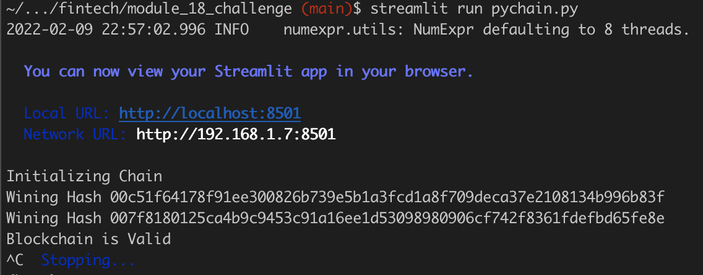
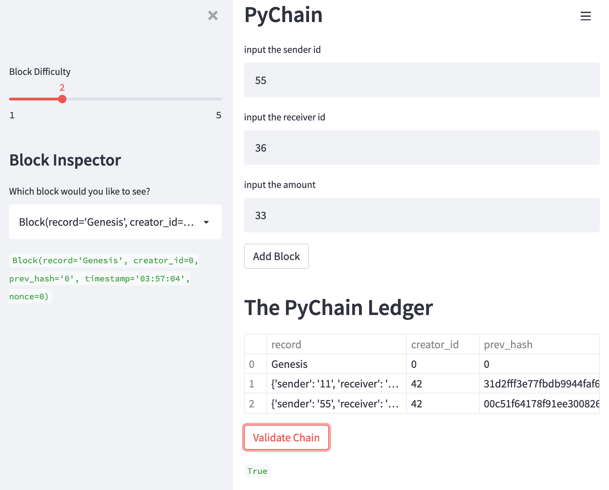

# Pychain

A sample blockchain-based ledger system, completed with a user-friendly web interface. This ledger should allow transfer money between senders and receivers and to verify the integrity of the data in the ledger.

